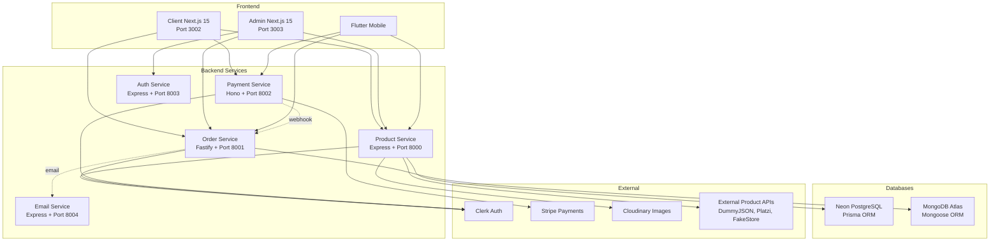

# Comprehensive Analysis Report: Neurashop E-commerce Platform

**Project:** Neurashop by Neuraltale - E-commerce Microservices Architecture
**Analysis Date:** 2026-04-04
**Analyst:** Kilo Code (Architect Mode)
**Version:** 1.0

---

## Executive Summary

Neurashop is a production-grade e-commerce platform built with a microservices architecture using Turborepo monorepo. The system comprises 5 backend services (product, order, payment, auth, email), 2 Next.js 15 frontends (client and admin), and a Flutter mobile app. The platform targets the Tanzanian market with TZS currency, local delivery options, and tech product focus.

**Overall Assessment:** The platform demonstrates solid architectural foundations with modern technology choices, but has significant gaps in user experience, error handling, testing, and production readiness that need addressing for optimal user satisfaction and business growth.

**Key Metrics at a Glance:**
| Metric | Current State | Target |
|--------|--------------|--------|
| Services | 5 backend + 2 frontend + 1 mobile | Stable |
| Auth Provider | Clerk (consistent across services) | ✅ Good |
| Databases | PostgreSQL (Prisma) + MongoDB | ⚠️ Dual DB complexity |
| Payment | Stripe (optional) | ⚠️ Single provider |
| Testing Coverage | None detected | >70% |
| Error Monitoring | None detected | Sentry/Datadog |
| CI/CD Pipeline | Basic (turbo) | GitHub Actions |

---

## 1. User Interface & User Experience (UI/UX) Analysis

### 1.1 Client Application (Customer-Facing)

#### Strengths
- **Brand Consistency:** Uses consistent color palette (`#001E3C` navy, `#0A7EA4` teal, `#FDB913` gold) across all components
- **Homepage Structure:** Well-organized sections (Hero, Flash Deals, Featured Products, Trust Indicators, Testimonials, Newsletter)
- **SEO Optimization:** Comprehensive metadata with category-specific titles, descriptions, and Open Graph tags
- **Responsive Design:** Mobile-first approach with responsive breakpoints (`sm:`, `md:`, `lg:`)
- **Cart Experience:** Multi-step checkout flow (Cart → Delivery → Confirm) with visual progress indicators

#### Weaknesses
- **Cart Size/Color Logic:** Products have sizes and colors which are unusual for tech products (laptops, phones don't typically have sizes like "S/M/L")
- **Loading States:** Basic spinner for cart hydration; no skeleton loaders for product listings
- **Search Experience:** No visible search bar on homepage; search only accessible via products page
- **Product Filtering:** Filter sidebar is hidden on mobile behind a sheet; no visual feedback during filter application
- **Empty States:** Generic empty state messages without personalized recommendations
- **No Wishlist:** Missing wishlist/favorites functionality for product saving
- **No Product Reviews:** Customer cannot leave or view product reviews
- **No Recently Viewed:** Missing recently viewed products feature

#### Critical UX Gaps
1. **No Order Tracking:** Orders page shows basic info but no real-time tracking or status updates
2. **No Account Management:** Missing user profile page for order history, addresses, preferences
3. **No Guest Checkout:** Cart requires authentication (Clerk middleware)
4. **No Cart Persistence:** Cart stored in Zustand (client-side only); lost on browser clear

### 1.2 Admin Application (Back Office)

#### Strengths
- **Dashboard Analytics:** Good overview with charts (bar, area, pie) for orders and status distribution
- **Data Tables:** Comprehensive data tables with sorting, filtering, and pagination for products, orders, users, categories
- **Product Management:** Rich product creation form with external API import capability
- **Role-Based Access:** Admin role checking in middleware prevents unauthorized access
- **Settings Page:** Well-organized settings with tabs for profile, notifications, appearance, regional

#### Weaknesses
- **Inbox Uses Mock Data:** Notification inbox is hardcoded with mock data, not connected to real events
- **Settings Not Persisted:** Settings changes only show toast notifications; no actual API calls to save
- **Product Form Complexity:** AddProduct component is 54KB+ which indicates excessive complexity
- **No Bulk Operations:** Missing bulk product import/export, bulk price updates, bulk status changes
- **No Audit Trail:** No logging of admin actions (who changed what, when)
- **No Image Management:** No centralized media library; images managed per-product

#### Critical Admin Gaps
1. **No Inventory Alerts:** Low stock threshold exists in schema but no alerting system
2. **No Sales Reports:** Missing comprehensive sales reporting (daily, weekly, monthly exports)
3. **No Customer Management:** Cannot view or manage customer details beyond basic user list
4. **No Content Management:** No CMS for homepage banners, testimonials, FAQ

### 1.3 Mobile Application (Flutter)

- **Status:** Present but not analyzed in depth (Flutter app in `apps/mobile`)
- **Setup Documentation:** Has SETUP.md and GETTING_STARTED.md
- **Auth:** Uses Clerk tokens via API

---

## 2. Technical Performance Analysis

### 2.1 Architecture Strengths



**Positive Architecture Decisions:**
- **Framework Diversity:** Each service uses the best-fit framework (Express for product, Fastify for order, Hono for payment)
- **Shared Packages:** `@repo/types`, `@repo/product-db`, `@repo/order-db` reduce duplication
- **Health Endpoints:** All services have `/health` endpoints for monitoring
- **CORS Configuration:** Properly configured allowed origins per service
- **Environment Variable Management:** Clear separation of `NEXT_PUBLIC_*` for frontend

### 2.2 Performance Concerns

| Issue | Impact | Severity |
|-------|--------|----------|
| No caching layer (Redis) | High latency on repeated queries | High |
| In-memory cache for external products | Lost on restart, no distributed caching | Medium |
| No CDN for API responses | Slower global access | Medium |
| No database connection pooling config | Potential connection exhaustion | High |
| No rate limiting on most endpoints | Vulnerable to abuse | High |
| No request timeout configuration | Hanging requests possible | Medium |
| `cache: "no-store"` on all dashboard fetches | No server-side caching | Medium |
| Large bundle size (AddProduct 54KB+) | Slow admin page loads | Medium |

### 2.3 Database Architecture Issues

**Dual Database Problem:**
- Products use PostgreSQL (Prisma + Neon)
- Orders use MongoDB (Mongoose + Atlas)
- **Impact:** Cannot perform JOIN queries across products and orders
- **Workaround:** Order stores product names/quantities/prices as embedded data (denormalized)
- **Risk:** Data inconsistency if product prices change after order creation

**Schema Gaps:**
- Order model only has `success` and `failed` statuses (no `pending`, `processing`, `shipped`, `delivered`, `cancelled`)
- No delivery address stored in order model
- No order tracking number
- No payment method stored
- User model doesn't exist in either database (relies entirely on Clerk)

---

## 3. Feature Functionality Assessment

### 3.1 Implemented Features

| Feature | Status | Quality |
|---------|--------|---------|
| Product Catalog | ✅ Complete | Good |
| Product Search | ✅ Complete | Good |
| Product Filtering | ✅ Complete | Good |
| Shopping Cart | ✅ Complete | Good |
| Checkout Flow | ✅ Partial | ⚠️ Stripe only |
| Order History | ✅ Basic | ⚠️ Minimal info |
| Admin Dashboard | ✅ Complete | Good |
| Product CRUD | ✅ Complete | Good |
| Order Management | ✅ Basic | ⚠️ Limited |
| User Management | ✅ Basic | ⚠️ Clerk-dependent |
| Category Management | ✅ Complete | Good |
| External Product Import | ✅ Complete | Good |
| Hero Products | ✅ Complete | Good |
| Payment Processing | ✅ Partial | ⚠️ Stripe only |
| Email Notifications | ⚠️ Service exists | Not analyzed |
| Notifications Inbox | ❌ Mock data | Not functional |
| Settings | ❌ Not persisted | UI only |
| Wishlist | ❌ Not implemented | - |
| Product Reviews | ❌ Not implemented | - |
| Order Tracking | ❌ Not implemented | - |
| Guest Checkout | ❌ Not implemented | - |
| Multi-currency | ❌ TZS only | - |
| Coupon/Discount Codes | ❌ Not implemented | - |
| Inventory Alerts | ❌ Not implemented | Schema exists |

### 3.2 Feature Completeness Score

```
Core E-commerce:     ████████░░ 80%
Admin Features:      ██████░░░░ 60%
User Experience:     █████░░░░░ 50%
Marketing Features:  ████░░░░░░ 40%
Analytics:           ██████░░░░ 60%
Overall:             ██████░░░░ 58%
```

---

## 4. Security Analysis

### 4.1 Security Strengths

| Area | Implementation | Status |
|------|---------------|--------|
| Authentication | Clerk (industry-standard) | ✅ Excellent |
| Authorization | Role-based (admin/user) | ✅ Good |
| CORS | Configured allowed origins | ✅ Good |
| Security Headers | X-Content-Type-Options, X-Frame-Options, X-XSS-Protection, Referrer-Policy | ✅ Good |
| Stripe Webhooks | Signature verification | ✅ Good |
| Environment Variables | Properly separated secrets | ✅ Good |
| Password Storage | Handled by Clerk (no local passwords) | ✅ Excellent |

### 4.2 Security Vulnerabilities

| Vulnerability | Location | Risk | Recommendation |
|--------------|----------|------|----------------|
| No rate limiting | Most API endpoints | High | Implement express-rate-limit or similar |
| No input validation | Product/order creation | Medium | Add Zod/Joi validation on backend |
| No CSRF protection | Forms | Medium | Add CSRF tokens for state-changing operations |
| Error messages expose internals | Error handlers log full errors | Low | Sanitize error responses in production |
| No API key rotation | External APIs | Low | Implement key rotation schedule |
| Hardcoded URLs in CORS | `allowedOrigins` arrays | Medium | Use environment variables only |
| No request size limits | Express/Fastify/Hono | Medium | Set body size limits to prevent DoS |
| Stripe key in frontend | `STRIPE_SECRET_KEY` in admin page.tsx | Critical | Move Stripe balance fetch to API route |

### 4.3 Data Protection Gaps

- **No data encryption at rest** (beyond what DB providers offer)
- **No PII handling policy** (email, delivery addresses stored in plain text)
- **No data retention policy** (orders never deleted)
- **No GDPR compliance** (no data export/delete functionality)
- **No audit logging** (no record of who changed what)

---

## 5. Accessibility Analysis

### 5.1 Current Accessibility Features

| Feature | Status |
|---------|--------|
| Semantic HTML | ✅ Partial (uses Next.js components) |
| ARIA labels | ✅ Some (cart delete buttons have aria-label) |
| Keyboard navigation | ⚠️ Untested |
| Color contrast | ⚠️ Needs audit (gold on navy may fail WCAG) |
| Screen reader support | ⚠️ Untested |
| Focus management | ⚠️ Not implemented |
| Skip navigation | ❌ Not implemented |
| Alt text for images | ⚠️ Partial (product images have alt text) |

### 5.2 Accessibility Issues

1. **No skip-to-content link** for keyboard users
2. **No focus visible styles** defined in global CSS
3. **Color-only indicators** (status badges rely on color alone)
4. **No reduced motion support** for animations
5. **Form labels** may not be properly associated with inputs
6. **No language attribute** set dynamically for multi-language support

---

## 6. User Value & Business Impact

### 6.1 Value Proposition

| Stakeholder | Value Delivered | Gaps |
|-------------|----------------|------|
| Customers | Tech product shopping, online ordering, delivery | No reviews, no wishlist, no order tracking |
| Admins | Product/order management, sales analytics | No bulk operations, no reports, no audit trail |
| Business | Online presence, payment processing | No marketing tools, no coupons, no analytics |

### 6.2 Business Impact Assessment

**Revenue Impact:**
- ✅ Stripe integration enables online payments
- ❌ No coupon/discount system limits promotional campaigns
- ❌ No abandoned cart recovery loses potential sales
- ❌ No product recommendations reduces cross-selling

**Operational Impact:**
- ✅ Admin dashboard provides sales visibility
- ❌ No inventory alerts risk stockouts
- ❌ No bulk operations increase admin workload
- ❌ No reporting limits data-driven decisions

**Customer Retention Impact:**
- ❌ No account management reduces personalization
- ❌ No order tracking increases support inquiries
- ❌ No reviews reduce trust and engagement
- ❌ No wishlist reduces return visits

---

## 7. Strengths, Weaknesses, and Gaps Summary

### 7.1 Strengths

1. **Modern Architecture:** Microservices with appropriate framework choices
2. **Consistent Auth:** Clerk integration across all services
3. **Type Safety:** TypeScript throughout, shared types via `@repo/types`
4. **SEO Optimized:** Comprehensive metadata and structured data
5. **Brand Consistency:** Unified design system across client and admin
6. **External Product Import:** Multi-API fallback with caching
7. **Deployment Ready:** Render configuration and Vercel deployment docs

### 7.2 Weaknesses

1. **No Testing:** Zero test files detected across the entire codebase
2. **No Error Monitoring:** No Sentry, Datadog, or similar
3. **No CI/CD:** No GitHub Actions or automated deployment pipeline
4. **Dual Database Complexity:** PostgreSQL + MongoDB increases operational overhead
5. **Mock Data in Production:** Inbox and settings use hardcoded data
6. **No Caching Layer:** No Redis or CDN for API responses
7. **Limited Payment Options:** Stripe only (no mobile money for Tanzania)
8. **No Rate Limiting:** API endpoints vulnerable to abuse

### 7.3 Critical Gaps

1. **No Order Status Flow:** Only `success`/`failed` - missing `pending`, `processing`, `shipped`, `delivered`, `cancelled`
2. **No Delivery Integration:** Delivery form exists but no integration with delivery services
3. **No Email Templates:** Email service exists but no template system
4. **No Search Indexing:** No full-text search (relies on database queries)
5. **No Image Optimization:** No Cloudinary transformations configured
6. **No Mobile Parity:** Mobile app feature set unknown
7. **No Analytics Integration:** No Google Analytics, Mixpanel, or similar

---

## 8. Prioritized Recommendations

### 8.1 Impact/Effort Matrix

```
HIGH IMPACT
    │
    │  P0: Critical    │  P1: Important
    │  • Testing       │  • Redis caching
    │  • Error monitoring │  • Rate limiting
    │  • Order status flow │  • Product reviews
    │  • Security fixes │  • Wishlist
    │
    ├──────────────────┼──────────────────
    │  P2: Valuable    │  P3: Nice-to-have
    │  • Bulk operations │  • Dark mode
    │  • Sales reports  │  • Multi-language
    │  • Inventory alerts │  • Advanced analytics
    │  • Coupon system  │  • Social sharing
    │
    └──────────────────┴──────────────────
    LOW EFFORT              HIGH EFFORT
```

### 8.2 Priority Breakdown

#### P0: Critical (Fix Immediately)

| # | Recommendation | Impact | Effort | Details |
|---|---------------|--------|--------|---------|
| 1 | Add unit and integration tests | Critical | High | Start with critical paths: cart, checkout, auth |
| 2 | Implement error monitoring (Sentry) | Critical | Low | Add to all services and frontends |
| 3 | Fix order status flow | Critical | Medium | Add pending, processing, shipped, delivered, cancelled |
| 4 | Move Stripe secret key to API route | Critical | Low | Remove server-side Stripe call from admin page.tsx |
| 5 | Add rate limiting to all endpoints | High | Medium | Use express-rate-limit, fastify-rate-limit |
| 6 | Add input validation on backend | High | Medium | Add Zod schemas to all POST/PUT endpoints |

#### P1: Important (Next Sprint)

| # | Recommendation | Impact | Effort | Details |
|---|---------------|--------|--------|---------|
| 7 | Implement Redis caching | High | Medium | Cache product listings, categories, hero products |
| 8 | Add product reviews and ratings | High | High | New schema, UI, moderation system |
| 9 | Implement wishlist functionality | High | Medium | New schema, UI, API endpoints |
| 10 | Connect inbox to real events | Medium | Medium | Replace mock data with WebSocket or polling |
| 11 | Persist settings to database | Medium | Low | Create settings schema and API |
| 12 | Add abandoned cart recovery | High | Medium | Email triggers for incomplete checkouts |

#### P2: Valuable (Next Quarter)

| # | Recommendation | Impact | Effort | Details |
|---|---------------|--------|--------|---------|
| 13 | Implement bulk product operations | Medium | Medium | CSV import/export, bulk price updates |
| 14 | Add sales reporting and exports | Medium | Medium | Daily/weekly/monthly reports, PDF/CSV export |
| 15 | Implement inventory alerting | Medium | Low | Email alerts when stock below threshold |
| 16 | Add coupon/discount system | High | High | New schema, validation, checkout integration |
| 17 | Add mobile money payment (M-Pesa, Tigo Pesa) | High | High | Critical for Tanzanian market |
| 18 | Implement audit logging | Medium | Medium | Log all admin actions with timestamps |

#### P3: Nice-to-have (Future)

| # | Recommendation | Impact | Effort | Details |
|---|---------------|--------|--------|---------|
| 19 | Add dark mode support | Low | Medium | Theme toggle in settings |
| 20 | Implement multi-language (Swahili) | Medium | High | i18n for client-facing pages |
| 21 | Add advanced analytics dashboard | Medium | High | Customer segmentation, product performance |
| 22 | Implement social sharing | Low | Low | Share products on WhatsApp, Facebook |
| 23 | Add recently viewed products | Low | Medium | LocalStorage or cookie-based |
| 24 | Implement guest checkout | High | Medium | Allow checkout without account creation |

---

## 9. Implementation Roadmap

### Phase 1: Foundation & Stability (Weeks 1-4)

```mermaid
gantt
    title Phase 1: Foundation & Stability
    dateFormat  W
    section Critical
    Error Monitoring (Sentry)     :w1, 1w
    Rate Limiting                 :w1, 2w
    Input Validation              :w2, 2w
    Stripe Key Security Fix       :w1, 1w
    section Testing
    Unit Tests (Core Services)    :w2, 3w
    Integration Tests (Checkout)  :w3, 2w
    section Data
    Order Status Flow Redesign    :w3, 2w
    Database Migration            :w4, 1w
```

**Deliverables:**
- [ ] Sentry integrated across all services
- [ ] Rate limiting on all public endpoints
- [ ] Zod validation on all POST/PUT endpoints
- [ ] Stripe secret key moved to API route
- [ ] 60%+ test coverage on critical paths
- [ ] Order status flow expanded to 6 states
- [ ] Database migration for new order statuses

**Success Metrics:**
- Zero unhandled errors in production
- API response times under 200ms (p95)
- Test coverage > 60%
- No security vulnerabilities in audit

### Phase 2: User Experience (Weeks 5-8)

```mermaid
gantt
    title Phase 2: User Experience
    dateFormat  W
    section Customer
    Product Reviews               :w5, 3w
    Wishlist                      :w6, 2w
    Guest Checkout                :w7, 2w
    Order Tracking                :w8, 2w
    section Admin
    Real Notifications            :w5, 2w
    Settings Persistence          :w5, 1w
    Inventory Alerts              :w6, 2w
    section Caching
    Redis Integration             :w5, 2w
    API Response Caching          :w6, 2w
```

**Deliverables:**
- [ ] Product reviews with moderation
- [ ] Wishlist functionality
- [ ] Guest checkout flow
- [ ] Order tracking page
- [ ] Real-time admin notifications
- [ ] Settings persistence
- [ ] Inventory alerting system
- [ ] Redis caching layer

**Success Metrics:**
- 20% increase in return visits (wishlist usage)
- 15% increase in conversion rate (guest checkout)
- 50% reduction in support tickets (order tracking)
- API response times under 100ms (cached)

### Phase 3: Business Growth (Weeks 9-12)

```mermaid
gantt
    title Phase 3: Business Growth
    dateFormat  W
    section Revenue
    Mobile Money Integration      :w9, 3w
    Coupon System                 :w10, 3w
    Abandoned Cart Recovery       :w11, 2w
    section Operations
    Bulk Operations               :w9, 2w
    Sales Reports                 :w10, 2w
    Audit Logging                 :w11, 2w
    section Marketing
    Email Templates               :w12, 2w
    Advanced Analytics            :w12, 2w
```

**Deliverables:**
- [ ] M-Pesa/Tigo Pesa integration
- [ ] Coupon/discount system
- [ ] Abandoned cart email recovery
- [ ] Bulk product import/export
- [ ] Sales reporting dashboard
- [ ] Audit logging system
- [ ] Email template system
- [ ] Advanced analytics

**Success Metrics:**
- 30% of payments via mobile money
- 10% revenue increase from coupon usage
- 15% recovery rate on abandoned carts
- 50% reduction in admin time (bulk operations)

---

## 10. Suggested Success Metrics

### 10.1 Technical Metrics

| Metric | Current | Target (3 months) | Target (6 months) |
|--------|---------|-------------------|-------------------|
| API Response Time (p95) | Unknown | < 200ms | < 100ms |
| Page Load Time (LCP) | Unknown | < 2.5s | < 1.5s |
| Test Coverage | 0% | 60% | 80% |
| Uptime | Unknown | 99.5% | 99.9% |
| Error Rate | Unknown | < 1% | < 0.1% |
| Cache Hit Rate | 0% | 50% | 80% |

### 10.2 Business Metrics

| Metric | Current | Target (3 months) | Target (6 months) |
|--------|---------|-------------------|-------------------|
| Conversion Rate | Unknown | 2% | 3.5% |
| Cart Abandonment | Unknown | < 60% | < 50% |
| Return Visit Rate | Unknown | 30% | 45% |
| Average Order Value | Unknown | Baseline | +15% |
| Customer Support Tickets | Unknown | Baseline | -30% |

### 10.3 User Satisfaction Metrics

| Metric | Method | Target |
|--------|--------|--------|
| Net Promoter Score | Survey | > 50 |
| Customer Satisfaction | Post-purchase survey | > 4/5 |
| Task Completion Rate | Analytics | > 85% |
| Error Rate per Session | Monitoring | < 0.5 |

---

## 11. Risk Assessment

| Risk | Probability | Impact | Mitigation |
|------|------------|--------|------------|
| Clerk service outage | Low | High | Implement fallback auth, cache sessions |
| Stripe payment failures | Medium | High | Add mobile money alternative |
| Database connection exhaustion | Medium | High | Implement connection pooling |
| API rate limit abuse | High | Medium | Add rate limiting, monitoring |
| Data breach | Low | Critical | Regular security audits, encryption |
| Performance degradation | Medium | Medium | Implement caching, monitoring |
| Mobile app feature gap | High | Medium | Align mobile features with web |

---

## 12. Conclusion

The Neurashop platform has a solid foundation with modern architecture, consistent authentication, and good SEO practices. However, it requires immediate attention in testing, error monitoring, security hardening, and order management before it can be considered production-ready for scale.

The recommended phased approach prioritizes stability first, then user experience, then business growth. This ensures the platform can handle increased traffic and transactions while maintaining reliability and security.

**Immediate Next Steps:**
1. Set up Sentry for error monitoring
2. Add rate limiting to all public endpoints
3. Move Stripe secret key from admin page to API route
4. Begin writing tests for critical checkout flow
5. Plan order status flow redesign

---

*Report generated by Kilo Code Architect Mode*
*For questions or clarifications, please review specific sections above.*
