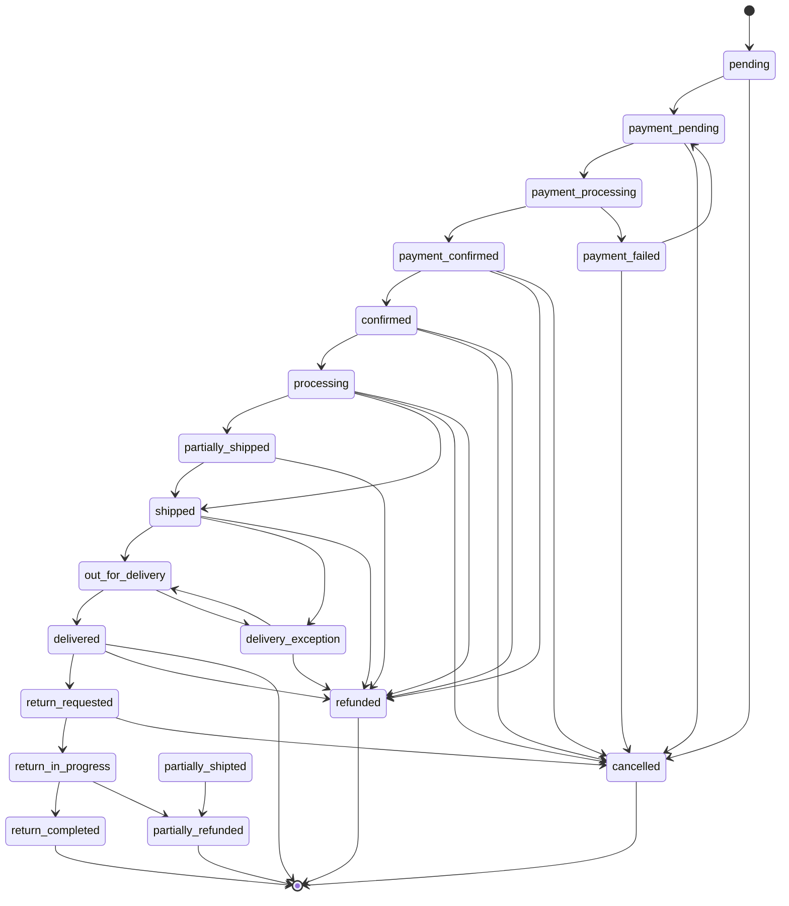
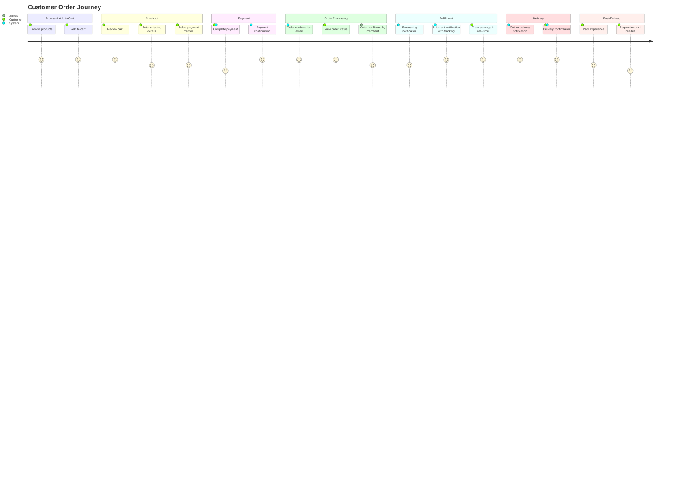

# Order Status Flow Redesign Plan

## Executive Summary

This document outlines a comprehensive plan to redesign the order status flow for the Neurashop digital commerce platform. The current implementation uses a minimal two-state model (`success`/`failed`) with no intermediate tracking, no shipment visibility, and limited user-facing feedback. This redesign introduces a full lifecycle state machine, real-time tracking, proactive notifications, and a polished user experience across web and mobile touchpoints.

---

## Table of Contents

1. [Current State Audit](#1-current-state-audit)
2. [Proposed State Machine Design](#2-proposed-state-machine-design)
3. [User Journey Mapping](#3-user-journey-mapping)
4. [UI/UX Recommendations](#4-uiux-recommendations)
5. [Implementation Roadmap](#5-implementation-roadmap)
6. [Measurable Success Criteria](#6-measurable-success-criteria)

---

## 1. Current State Audit

### 1.1 Existing Architecture Overview

The current order management system consists of the following services:

| Service | Technology | Role |
|---------|-----------|------|
| **order-service** | Fastify (Node.js) | Order CRUD, dashboard stats |
| **payment-service** | Hono (Node.js) + Stripe | Payment processing, webhook handling |
| **email-service** | Express (Node.js) | Transactional email delivery |
| **admin app** | Next.js (App Router) | Admin dashboard for order management |
| **client app** | Next.js (App Router) | Customer-facing order history |

### 1.2 Current Order Schema

Source: [`packages/order-db/src/order-model.ts`](../packages/order-db/src/order-model.ts:1)

```typescript
export const OrderStatus = ["success", "failed"] as const;

const OrderSchema = new Schema({
  userId: { type: String, required: true },
  email: { type: String, required: true },
  amount: { type: Number, required: true },
  status: { type: String, required: true, enum: OrderStatus },
  products: {
    type: [{
      name: { type: String, required: true },
      quantity: { type: Number, required: true },
      price: { type: Number, required: true },
    }],
    required: true,
  },
}, { timestamps: true });
```

### 1.3 Identified Problems

#### User Confusion Points

| # | Issue | Impact | Evidence |
|---|-------|--------|----------|
| 1 | **Binary status only** (`success`/`failed`) | Users cannot distinguish between "payment confirmed but not shipped" vs "delivered" | [`apps/client/src/app/orders/page.tsx`](../apps/client/src/app/orders/page.tsx:114) shows only green/red badges |
| 2 | **No order detail page** | Users cannot drill into individual orders for line-item details, tracking numbers, or delivery estimates | [`apps/client/src/app/orders/page.tsx`](../apps/client/src/app/orders/page.tsx:86) renders a flat list only |
| 3 | **No progress visualization** | No visual stepper or timeline to show where the order is in its lifecycle | Current UI uses a single colored badge |
| 4 | **No estimated delivery date** | Users have no expectation of when to receive their order | Schema has no `estimatedDelivery` field |
| 5 | **No tracking number display** | Once shipped, users have no way to track their package | Schema has no `trackingNumber` or `carrier` fields |

#### Support Ticket Drivers

| # | Issue | Root Cause |
|---|-------|------------|
| 1 | "Where is my order?" (WISMO) | No shipment tracking or delivery status |
| 2 | "Was my payment successful?" | Ambiguous `success` status conflates payment confirmation with order fulfillment |
| 3 | "Can I cancel my order?" | No cancellation flow or status |
| 4 | "I only received part of my order" | No partial shipment support |
| 5 | "My order is delayed" | No delivery exception handling or proactive notification |

#### Technical Constraints

| # | Constraint | Details |
|---|-----------|---------|
| 1 | **Two-state enum** | `OrderStatus` only allows `success` or `failed` — see [`packages/order-db/src/order-model.ts:4`](../packages/order-db/src/order-model.ts:4) |
| 2 | **No status transition validation** | Any status change is accepted without state machine enforcement |
| 3 | **Single email notification** | Only one email sent at order creation — see [`apps/order-service/src/utils/order.ts:11`](../apps/order-service/src/utils/order.ts:11) |
| 4 | **No WebSocket or SSE** | Real-time updates not supported; client must poll |
| 5 | **No order history/audit log** | Status changes are not tracked with timestamps or reasons |
| 6 | **Payment webhook creates order directly** | See [`apps/payment-service/src/routes/webhooks.route.ts:38`](../apps/payment-service/src/routes/webhooks.route.ts:38) — order is created only after payment completes, so no `pending` state exists |
| 7 | **No idempotency** | Order creation has no idempotency key, risking duplicates |

---

## 2. Proposed State Machine Design

### 2.1 Order Status Definitions

| Status | Category | Description | User-Facing Label |
|--------|----------|-------------|-------------------|
| `pending` | Pre-Payment | Order created, awaiting payment | "Awaiting Payment" |
| `payment_pending` | Pre-Payment | Checkout session created, user redirected to payment | "Complete Your Payment" |
| `payment_processing` | Payment | Payment authorized, being verified | "Payment Processing" |
| `payment_confirmed` | Payment | Payment successful, order being prepared | "Payment Confirmed" |
| `payment_failed` | Payment | Payment declined or expired | "Payment Failed" |
| `confirmed` | Processing | Order confirmed by merchant, preparing for shipment | "Order Confirmed" |
| `processing` | Processing | Items being picked and packed | "Processing" |
| `partially_shipped` | Fulfillment | Some items shipped, others pending | "Partially Shipped" |
| `shipped` | Fulfillment | All items shipped, in transit | "Shipped" |
| `out_for_delivery` | Fulfillment | Package with local courier for same-day delivery | "Out for Delivery" |
| `delivered` | Completed | Package delivered to customer | "Delivered" |
| `cancelled` | Terminal | Order cancelled by user or admin | "Cancelled" |
| `refunded` | Terminal | Full refund issued | "Refunded" |
| `partially_refunded` | Terminal | Partial refund issued | "Partially Refunded" |
| `delivery_exception` | Exception | Delivery failed (wrong address, no one home, etc.) | "Delivery Issue" |
| `return_requested` | Exception | Customer initiated return | "Return Requested" |
| `return_in_progress` | Exception | Return being processed | "Return in Progress" |
| `return_completed` | Terminal | Return completed, refund issued | "Return Completed" |

### 2.2 State Transition Diagram



### 2.3 Valid Transition Rules

| From Status | Allowed Transitions | Triggered By |
|-------------|-------------------|--------------|
| `pending` | `payment_pending`, `cancelled` | User initiates checkout / User or admin cancels |
| `payment_pending` | `payment_processing`, `cancelled` | User opens payment page / Timeout or cancel |
| `payment_processing` | `payment_confirmed`, `payment_failed` | Stripe webhook confirms / Stripe webhook declines |
| `payment_failed` | `payment_pending`, `cancelled` | User retries payment / Auto-cancel after timeout |
| `payment_confirmed` | `confirmed`, `refunded`, `cancelled` | Admin confirms / Admin issues refund / Admin cancels |
| `confirmed` | `processing`, `cancelled`, `refunded` | Admin starts fulfillment / Admin cancels / Admin refunds |
| `processing` | `partially_shipped`, `shipped`, `cancelled`, `refunded` | Admin creates shipment(s) / Admin cancels / Admin refunds |
| `partially_shipped` | `shipped`, `refunded`, `partially_refunded` | Remaining items shipped / Admin refunds |
| `shipped` | `out_for_delivery`, `delivery_exception`, `refunded` | Carrier update / Carrier reports issue / Admin refunds |
| `out_for_delivery` | `delivered`, `delivery_exception` | Carrier confirms delivery / Delivery attempt failed |
| `delivery_exception` | `out_for_delivery`, `refunded` | Re-attempt scheduled / Admin refunds |
| `delivered` | `return_requested`, `refunded` | User requests return / Admin issues refund |
| `return_requested` | `return_in_progress`, `cancelled` | Admin approves return / Admin rejects return |
| `return_in_progress` | `return_completed`, `partially_refunded` | Return received and processed |
| `refunded` | Terminal | — |
| `cancelled` | Terminal | — |
| `delivered` | Terminal (except returns) | — |
| `return_completed` | Terminal | — |
| `partially_refunded` | Terminal | — |

### 2.4 Edge Case Handling

#### Cancellations

| Scenario | Behavior |
|----------|----------|
| User cancels before payment | Transition `pending` → `cancelled`, release reserved inventory |
| User cancels during payment window | Transition `payment_pending` → `cancelled`, invalidate checkout session |
| Admin cancels after payment | Transition to `cancelled`, trigger automatic refund via Stripe |
| Auto-cancel after payment timeout | If `payment_pending` exceeds 30 minutes, auto-transition to `cancelled` |

#### Refunds

| Scenario | Behavior |
|----------|----------|
| Full refund before shipment | Transition `payment_confirmed` or `confirmed` → `refunded`, issue Stripe refund |
| Full refund after shipment | Transition `shipped` or `delivered` → `refunded`, initiate return logistics |
| Partial refund (damaged item) | Transition to `partially_refunded`, record refund amount and reason |
| Refund on partial shipment | Refund only unshipped items, keep order as `partially_shipped` |

#### Partial Shipments

| Scenario | Behavior |
|----------|----------|
| Multiple items, some in stock | Transition `processing` → `partially_shipped`, create shipment record for shipped items |
| Remaining items ship later | Transition `partially_shipped` → `shipped`, create additional shipment record |
| Remaining items out of stock | Transition `partially_shipped` → `partially_refunded`, refund unfulfilled items |

#### Delivery Exceptions

| Scenario | Behavior |
|----------|----------|
| Wrong address | Transition to `delivery_exception`, notify user to confirm address |
| No one home | Transition to `delivery_exception`, schedule re-delivery |
| Package damaged in transit | Transition to `delivery_exception`, initiate replacement or refund |
| Customs hold (international) | Transition to `delivery_exception`, notify user of required action |

### 2.5 Extended Order Schema

```typescript
export const OrderStatus = [
  "pending",
  "payment_pending",
  "payment_processing",
  "payment_confirmed",
  "payment_failed",
  "confirmed",
  "processing",
  "partially_shipped",
  "shipped",
  "out_for_delivery",
  "delivered",
  "cancelled",
  "refunded",
  "partially_refunded",
  "delivery_exception",
  "return_requested",
  "return_in_progress",
  "return_completed",
] as const;

export const OrderSchema = new Schema({
  userId: { type: String, required: true, index: true },
  email: { type: String, required: true },
  amount: { type: Number, required: true },
  status: { type: String, required: true, enum: OrderStatus, default: "pending" },
  
  // Payment details
  paymentIntentId: { type: String },
  paymentMethod: { type: String },
  paymentCompletedAt: { type: Date },
  
  // Shipping details
  shippingAddress: {
    fullName: { type: String, required: true },
    line1: { type: String, required: true },
    line2: { type: String },
    city: { type: String, required: true },
    state: { type: String },
    postalCode: { type: String, required: true },
    country: { type: String, required: true },
    phone: { type: String, required: true },
  },
  estimatedDeliveryDate: { type: Date },
  actualDeliveryDate: { type: Date },
  
  // Shipment tracking
  shipments: [{
    trackingNumber: { type: String },
    carrier: { type: String },
    items: [{ productId: String, quantity: Number }],
    shippedAt: { type: Date },
    deliveredAt: { type: Date },
    status: { type: String },
  }],
  
  // Cancellation details
  cancellationReason: { type: String },
  cancelledBy: { type: String }, // "user" or "admin"
  cancelledAt: { type: Date },
  
  // Refund details
  refunds: [{
    amount: { type: Number },
    reason: { type: String },
    refundIntentId: { type: String },
    status: { type: String },
    createdAt: { type: Date },
  }],
  
  // Products with per-item status for partial shipments
  products: [{
    name: { type: String, required: true },
    quantity: { type: Number, required: true },
    price: { type: Number, required: true },
    status: { type: String, enum: ["pending", "shipped", "delivered", "refunded"], default: "pending" },
    shipmentId: { type: String },
  }],
  
  // Status change audit log
  statusHistory: [{
    from: { type: String },
    to: { type: String },
    reason: { type: String },
    changedBy: { type: String }, // "system", "user", "admin"
    changedAt: { type: Date, default: Date.now },
  }],
  
  // Notification preferences
  notifications: {
    email: { type: Boolean, default: true },
    sms: { type: Boolean, default: false },
    push: { type: Boolean, default: true },
  },
}, { timestamps: true });
```

---

## 3. User Journey Mapping

### 3.1 End-to-End Journey Overview



### 3.2 Touchpoint Details

#### Web (Client App)

| Touchpoint | Page/Component | Key Information Displayed |
|-----------|---------------|--------------------------|
| Order list | `/orders` | Order ID, date, total, status badge, product summary |
| Order detail | `/orders/[id]` | Full timeline, tracking map, item-level status, actions |
| Cart | `/cart` | Order summary, estimated delivery, payment options |
| Checkout | `/checkout` | Shipping form, payment form, order review |
| Payment result | `/checkout/success` | Payment status, order confirmation, next steps |

#### Web (Admin App)

| Touchpoint | Page/Component | Key Information Displayed |
|-----------|---------------|--------------------------|
| Order list | `/orders` | All orders with sortable status, filtering, bulk actions |
| Order detail | `/orders/[id]` | Full order details, status change controls, refund/cancel actions |
| Dashboard | `/` | Order status distribution, daily trends, KPIs |

#### Mobile (Future)

| Touchpoint | Key Information Displayed |
|-----------|--------------------------|
| Push notifications | Real-time status updates with deep links |
| Order tracking screen | Live map, ETA countdown, carrier contact |
| Home screen widget | Latest order status at a glance |

### 3.3 Notification Triggers

| Trigger | Channel | Timing | Content |
|---------|---------|--------|---------|
| Order created | Email | Immediate | "Order received — order #12345" with summary |
| Payment confirmed | Email + Push | Immediate | "Payment confirmed — we're preparing your order" |
| Payment failed | Email + Push | Immediate | "Payment unsuccessful — please retry" with link |
| Order confirmed | Email + Push | Within 1 hour | "Order confirmed — estimated delivery: [date]" |
| Order shipped | Email + Push + SMS | Immediate | "Your order is on the way! Track: [link]" |
| Partial shipment | Email + Push | Immediate | "Part of your order has shipped — [items] on the way" |
| Out for delivery | Push + SMS | Morning of delivery | "Your order arrives today! Be ready by [time window]" |
| Delivered | Email + Push | Immediate | "Your order has been delivered — rate your experience" |
| Delivery exception | Email + Push + SMS | Immediate | "Delivery issue — [reason]. Action needed: [action]" |
| Refund issued | Email | Immediate | "Refund processed — [amount] will appear in 5-10 days" |
| Return approved | Email + Push | Immediate | "Return approved — ship back using [label]" |
| Auto-cancel warning | Email | 24h before | "Your order will be cancelled in 24 hours if payment isn't completed" |

### 3.4 Microcopy Guidelines

| Context | Current | Recommended |
|---------|---------|-------------|
| Pending payment | _(none)_ | "Complete your payment to confirm this order" |
| Payment processing | _(none)_ | "We're confirming your payment — this takes a moment" |
| Payment failed | `failed` (red badge) | "Payment wasn't successful. [Retry payment]" |
| Order confirmed | `success` (green badge) | "Order confirmed! We're getting it ready" |
| Processing | _(none)_ | "Your order is being packed and prepared for shipment" |
| Shipped | _(none)_ | "On its way! Track your package below" |
| Out for delivery | _(none)_ | "Arriving today! Your driver is on the way" |
| Delivered | _(none)_ | "Delivered! How was your experience? [Rate order]" |
| Cancelled | _(none)_ | "This order was cancelled. [Reason if provided]" |
| Delivery exception | _(none)_ | "We hit a bump. [Issue description]. [What to do next]" |

---

## 4. UI/UX Recommendations

### 4.1 Visual Hierarchy

#### Order List Page (Client)

Current state: [`apps/client/src/app/orders/page.tsx`](../apps/client/src/app/orders/page.tsx:86) — flat grid with minimal hierarchy.

Recommended layout:

```
┌─────────────────────────────────────────────────────────┐
│  Your Orders                              [Filter ▼]    │
├─────────────────────────────────────────────────────────┤
│  ┌───────────────────────────────────────────────────┐  │
│  │  Order #ORD-2024-12345        Status: 🟢 Shipped  │  │
│  │  Placed: Jan 15, 2024         Est. Delivery: Jan 20│  │
│  │                                                   │  │
│  │  ┌─────┐ ┌─────┐                                 │  │
│  │  │ IMG │ │ IMG │  Product A x2  ·  Product B x1  │  │
│  │  └─────┘ └─────┘                                 │  │
│  │                                                   │  │
│  │  Total: TZS 150,000     [Track Order] [View Details]│  │
│  └───────────────────────────────────────────────────┘  │
│  ┌───────────────────────────────────────────────────┐  │
│  │  Order #ORD-2024-12344        Status: 🟡 Processing│  │
│  │  ...                                               │  │
│  └───────────────────────────────────────────────────┘  │
└─────────────────────────────────────────────────────────┘
```

Key improvements:
- **Status badge** uses color + icon + descriptive text (not just raw enum value)
- **Estimated delivery date** prominently displayed for active orders
- **Product thumbnails** provide visual recognition
- **Primary action button** changes based on status (Track, View Details, Retry Payment)

#### Order Detail Page (New)

```
┌─────────────────────────────────────────────────────────┐
│  ← Back to Orders                                       │
│                                                         │
│  Order #ORD-2024-12345                                  │
│  Placed on January 15, 2024 at 2:30 PM                 │
│                                                         │
│  ┌───────────────────────────────────────────────────┐  │
│  │  STATUS: SHIPPED                                  │  │
│  │                                                   │  │
│  │  ○ Confirmed  ○ Processing  ● Shipped  ○ Delivered│  │
│  │     Jan 15        Jan 16      Jan 17               │  │
│  │                                                   │  │
│  │  📦 Tracking: 1Z999AA10123456784 (DHL)            │  │
│  │  📅 Estimated Delivery: January 20, 2024          │  │
│  │  [Track on Carrier Site]                          │  │
│  └───────────────────────────────────────────────────┘  │
│                                                         │
│  ┌───────────────────────────────────────────────────┐  │
│  │  Items                                            │  │
│  │  ┌─────┐                                          │  │
│  │  │ IMG │  Wireless Headphones x1      TZS 75,000  │  │
│  │  └─────┘  Status: Shipped                        │  │
│  │  ┌─────┐                                          │  │
│  │  │ IMG │  Phone Case x2               TZS 30,000  │  │
│  │  └─────┘  Status: Shipped                        │  │
│  └───────────────────────────────────────────────────┘  │
│                                                         │
│  ┌───────────────────────────────────────────────────┐  │
│  │  Shipping Address                                 │  │
│  │  John Doe                                         │  │
│  │  123 Sample Street, Dar es Salaam, Tanzania       │  │
│  └───────────────────────────────────────────────────┘  │
│                                                         │
│  ┌───────────────────────────────────────────────────┐  │
│  │  Payment                                          │  │
│  │  Method: Visa ending in 4242                      │  │
│  │  Amount: TZS 105,000                              │  │
│  │  Status: Paid                                     │  │
│  └───────────────────────────────────────────────────┘  │
│                                                         │
│  ┌───────────────────────────────────────────────────┐  │
│  │  Order Timeline                                   │  │
│  │                                                   │  │
│  │  📅 Jan 17, 10:30 AM — Shipped                    │  │
│  │     Package handed to DHL                         │  │
│  │  📅 Jan 16, 3:00 PM — Processing                  │  │
│  │     Order is being packed                         │  │
│  │  📅 Jan 15, 2:30 PM — Payment Confirmed           │  │
│  │     Visa ending in 4242                           │  │
│  │  📅 Jan 15, 2:28 PM — Order Placed                │  │
│  │     Order received                                │  │
│  └───────────────────────────────────────────────────┘  │
│                                                         │
│  [Need Help?]  [Request Return]  [Download Invoice]     │
└─────────────────────────────────────────────────────────┘
```

### 4.2 Progress Indicators

#### Stepper Component

Use a horizontal stepper for desktop and vertical stepper for mobile:

```
Desktop (horizontal):
  ○ Confirmed  ───  ○ Processing  ───  ● Shipped  ───  ○ Delivered
    Jan 15              Jan 16            Jan 17

Mobile (vertical):
  ✓ Order Placed       Jan 15, 2:28 PM
  ✓ Payment Confirmed  Jan 15, 2:30 PM
  ✓ Processing         Jan 16, 3:00 PM
  ● Shipped            Jan 17, 10:30 AM
    └─ Tracking: 1Z999AA10123456784
  ○ Estimated Delivery  Jan 20
```

Implementation: Create a reusable `<OrderStepper>` component in [`apps/client/src/components/`](../apps/client/src/components/).

#### Loading States

| State | Pattern | Implementation |
|-------|---------|----------------|
| Initial load | Skeleton cards | Use existing [`TableSkeleton`](../apps/admin/src/components/skeletons/TableSkeleton.tsx) pattern |
| Status refresh | Inline spinner | Small spinner next to status badge |
| Tracking map | Skeleton + shimmer | Placeholder with animated gradient |
| Action buttons | Disabled + spinner | `disabled` state with inline spinner during async operations |

### 4.3 Error Handling

| Error Type | Display | Recovery Action |
|-----------|---------|-----------------|
| Network error fetching orders | Full-page error boundary with retry button | "Couldn't load your orders. [Try Again]" |
| Single order fetch failure | Inline error banner on order detail page | "Couldn't load this order. [Retry]" |
| Payment failure | Modal with error details | "Payment declined. [Try a different card]" |
| Tracking API error | Graceful degradation | "Tracking info unavailable. Check back later." |
| Stale data indicator | "Last updated X minutes ago" banner | "[Refresh]" button |

### 4.4 Accessibility Compliance

| Requirement | Implementation |
|------------|----------------|
| WCAG 2.1 AA | All color combinations meet 4.5:1 contrast ratio |
| Screen reader support | Status badges use `aria-label` with full text (e.g., "Status: Shipped") |
| Keyboard navigation | All interactive elements reachable via Tab, actionable via Enter/Space |
| Focus management | Focus moves to order detail heading on navigation |
| Reduced motion | Stepper animations respect `prefers-reduced-motion` |
| Color independence | Status uses icon + text, not color alone |
| Form labels | All form inputs have associated `<label>` elements |
| Live regions | Status changes announced via `aria-live="polite"` |

### 4.5 Admin Dashboard Enhancements

#### Order Management Table

Current state: [`apps/admin/src/app/(dashboard)/orders/columns.tsx`](../apps/admin/src/app/(dashboard)/orders/columns.tsx:66) — basic status column with color-coded badges.

Recommended improvements:
- Add **status filter dropdown** with multi-select
- Add **date range picker** for filtering
- Add **search by order ID, email, or tracking number**
- Add **bulk status update** action
- Add **export to CSV** functionality
- Show **item count** and **fulfillment status** per order

#### Order Detail View (Admin)

Add ability to:
- Manually change status with reason dropdown
- Add internal notes visible only to admins
- Issue full or partial refunds
- Cancel orders with reason
- View customer communication history
- Print packing slips and shipping labels

---

## 5. Implementation Roadmap

### 5.1 Phase 1: Foundation (Weeks 1-3)

**Goal:** Extend data model and build state machine infrastructure.

| Task | Owner | Dependencies | Deliverable |
|------|-------|-------------|-------------|
| Extend OrderSchema with new fields | Backend Engineer | — | Updated Mongoose schema in `packages/order-db` |
| Update OrderType definitions | Backend Engineer | Schema update | Updated types in `packages/types` |
| Build state machine service | Backend Engineer | Type definitions | `apps/order-service/src/utils/stateMachine.ts` |
| Add status transition validation | Backend Engineer | State machine | Middleware that validates transitions |
| Add statusHistory audit logging | Backend Engineer | State machine | Automatic logging on every status change |
| Create database migration script | Backend Engineer | Schema update | Script to set existing `success` → `delivered`, `failed` → `payment_failed` |
| Write unit tests for state machine | QA Engineer | State machine | Test suite covering all valid/invalid transitions |

### 5.2 Phase 2: API & Notifications (Weeks 3-5)

**Goal:** Build new API endpoints and notification system.

| Task | Owner | Dependencies | Deliverable |
|------|-------|-------------|-------------|
| Add `PATCH /orders/:id/status` endpoint | Backend Engineer | Phase 1 | Status update API with validation |
| Add `GET /orders/:id` endpoint | Backend Engineer | Phase 1 | Single order detail endpoint |
| Add `GET /orders/:id/tracking` endpoint | Backend Engineer | Phase 1 | Tracking info endpoint |
| Build notification service | Backend Engineer | Phase 1 | `apps/order-service/src/utils/notifications.ts` |
| Extend email-service templates | Frontend Engineer | Notification service | Templates for all 12 notification types |
| Add SMS notification support | Backend Engineer | Notification service | Integration with SMS provider (e.g., Twilio) |
| Add webhook for carrier tracking | Backend Engineer | — | Webhook endpoint to receive carrier updates |
| Write integration tests for APIs | QA Engineer | API endpoints | Test suite for all new endpoints |

### 5.3 Phase 3: Client UI (Weeks 5-8)

**Goal:** Build customer-facing order tracking experience.

| Task | Owner | Dependencies | Deliverable |
|------|-------|-------------|-------------|
| Create OrderStepper component | Frontend Engineer | Phase 1 types | Reusable stepper component |
| Create OrderStatusBadge component | Frontend Engineer | Phase 1 types | Accessible status badge with icon |
| Create OrderTimeline component | Frontend Engineer | Phase 1 types | Vertical timeline with events |
| Build order detail page `/orders/[id]` | Frontend Engineer | Components above | Full order detail view |
| Enhance order list page `/orders` | Frontend Engineer | OrderStatusBadge | Improved list with better status display |
| Add real-time status polling | Frontend Engineer | API endpoints | Auto-refresh order status every 30s |
| Implement loading/error states | Frontend Engineer | Pages above | Skeleton screens and error boundaries |
| Add accessibility audit | QA Engineer | All UI components | WCAG 2.1 AA compliance report |
| Mobile responsive testing | Frontend Engineer | All UI components | Responsive design verification |

### 5.4 Phase 4: Admin UI (Weeks 7-9)

**Goal:** Enhance admin order management capabilities.

| Task | Owner | Dependencies | Deliverable |
|------|-------|-------------|-------------|
| Add status filter to order table | Frontend Engineer | Phase 1 types | Multi-select status filter |
| Add order detail page for admin | Frontend Engineer | Phase 3 components | Admin order detail view |
| Add status change dialog | Frontend Engineer | Admin detail page | Modal with reason dropdown |
| Add refund/cancel actions | Frontend Engineer | Admin detail page | Action buttons with confirmation |
| Add bulk actions | Frontend Engineer | Order table | Multi-select with bulk status update |
| Add internal notes feature | Backend + Frontend | Phase 1 schema | Notes CRUD API and UI |
| Write E2E tests for admin flows | QA Engineer | Admin UI | Playwright test suite |

### 5.5 Phase 5: Real-Time & Polish (Weeks 9-11)

**Goal:** Add real-time updates and finalize experience.

| Task | Owner | Dependencies | Deliverable |
|------|-------|-------------|-------------|
| Implement Server-Sent Events | Backend Engineer | Phase 2 APIs | SSE endpoint for order status stream |
| Add SSE client integration | Frontend Engineer | SSE endpoint | Real-time status updates without polling |
| Add push notification support | Frontend Engineer | Phase 2 notifications | Web push with service worker |
| Build carrier tracking integration | Backend Engineer | Phase 2 webhook | Integration with DHL/FedEx APIs |
| Add estimated delivery calculation | Backend Engineer | Carrier integration | ETA algorithm based on carrier data |
| Performance optimization | Backend + Frontend | All features | API response < 200ms, page load < 2s |
| Load testing | QA Engineer | All APIs | Verify 1000 concurrent users |

### 5.6 Phase 6: Rollout (Weeks 11-13)

**Goal:** Staged rollout with monitoring.

| Task | Owner | Dependencies | Deliverable |
|------|-------|-------------|-------------|
| Internal beta testing | QA + Product | All phases | Bug report and fix cycle |
| Canary release (5% traffic) | DevOps | Beta sign-off | Monitored deployment |
| Analyze canary metrics | Data Engineer | Canary release | Error rates, latency, CSAT |
| Gradual rollout (25% → 50% → 100%) | DevOps | Canary success | Full deployment |
| Update documentation | Technical Writer | All phases | User-facing help articles |
| Train support team | Product Manager | Documentation | Support team runbook |
| Post-launch monitoring | DevOps + QA | Full rollout | 2-week monitoring period |

### 5.7 API Synchronization Requirements

| Integration | Method | Frequency | Data Synced |
|------------|--------|-----------|-------------|
| order-service ↔ payment-service | Stripe webhook → HTTP POST | Event-driven | Payment status, order creation |
| order-service ↔ email-service | HTTP POST | Event-driven | Notification triggers |
| order-service ↔ carrier APIs | Webhook + polling | Every 15 min | Tracking events, delivery status |
| client app ↔ order-service | REST + SSE | Real-time (SSE) / 30s poll (fallback) | Order status, tracking |
| admin app ↔ order-service | REST | On-demand | Full order data, status updates |

### 5.8 Testing Protocols

| Test Type | Scope | Tools | Pass Criteria |
|-----------|-------|-------|---------------|
| Unit tests | State machine, utilities | Jest | 90%+ coverage |
| Integration tests | API endpoints | Supertest | All endpoints return correct responses |
| E2E tests | User journeys | Playwright | All critical paths pass |
| Accessibility tests | UI components | axe-core, Lighthouse | WCAG 2.1 AA, 0 critical issues |
| Performance tests | API latency, page load | k6, Lighthouse | p95 < 200ms API, < 2s page load |
| Load tests | Concurrent users | k6 | 1000 concurrent, < 1% error rate |
| Security tests | Auth, data exposure | OWASP ZAP | 0 critical/high vulnerabilities |

---

## 6. Measurable Success Criteria

### 6.1 Customer Support Metrics

| Metric | Baseline | Target | Measurement Method |
|--------|----------|--------|-------------------|
| WISMO tickets per week | TBD | -50% | Support ticket categorization |
| Payment status inquiries | TBD | -60% | Support ticket categorization |
| Cancellation requests | TBD | -30% | Support ticket categorization |
| Average resolution time | TBD | -25% | Support ticket timestamps |
| First-contact resolution rate | TBD | +20% | Support ticket surveys |

### 6.2 Engagement Metrics

| Metric | Baseline | Target | Measurement Method |
|--------|----------|--------|-------------------|
| Order tracking page views | 0 (no page exists) | 70% of orders viewed | Analytics events |
| Tracking link clicks | 0 | 50% of shipped orders | Analytics events |
| Return request self-service | 0 | 80% of returns self-initiated | Analytics events |
| Notification open rate | N/A | 60% email, 40% push | Email/push analytics |
| Time on order detail page | 0 | 45s average | Analytics events |

### 6.3 Satisfaction Metrics

| Metric | Baseline | Target | Measurement Method |
|--------|----------|--------|-------------------|
| CSAT score | TBD | 4.2/5.0 | Post-delivery survey |
| NPS | TBD | +40 | Quarterly survey |
| Order status clarity rating | TBD | 4.5/5.0 | In-app micro-survey |
| App store rating | TBD | 4.3+ stars | App store data |

### 6.4 System Performance Benchmarks

| Metric | Baseline | Target | Measurement Method |
|--------|----------|--------|-------------------|
| Order detail page load (LCP) | N/A | < 1.5s | Lighthouse CI |
| Order list page load (LCP) | TBD | < 2.0s | Lighthouse CI |
| API response time (p95) | TBD | < 200ms | APM monitoring |
| SSE connection reliability | N/A | 99.9% uptime | Infrastructure monitoring |
| Email delivery rate | TBD | 99% | Email service analytics |
| Notification latency (p95) | N/A | < 5 seconds | Internal monitoring |
| Error rate | TBD | < 0.1% | Error tracking (Sentry) |

### 6.5 Business Impact

| Metric | Baseline | Target | Measurement Method |
|--------|----------|--------|-------------------|
| Repeat purchase rate | TBD | +15% | Order analytics |
| Cart abandonment rate | TBD | -10% | Checkout analytics |
| Return processing cost | TBD | -40% | Operations cost tracking |
| Support cost per order | TBD | -35% | Finance + support data |

---

## Appendix A: File Change Summary

| File | Action | Description |
|------|--------|-------------|
| `packages/order-db/src/order-model.ts` | Modify | Extend schema with new statuses, shipments, statusHistory |
| `packages/types/src/order.ts` | Modify | Add new type definitions |
| `apps/order-service/src/utils/stateMachine.ts` | Create | State machine logic with transition validation |
| `apps/order-service/src/utils/notifications.ts` | Create | Notification dispatch service |
| `apps/order-service/src/routes/order.ts` | Modify | Add PATCH status endpoint, GET by ID, tracking endpoint |
| `apps/order-service/src/utils/email.ts` | Modify | Update to use notification service |
| `apps/email-service/src/index.ts` | Modify | Add new email template endpoints |
| `apps/payment-service/src/routes/webhooks.route.ts` | Modify | Update order creation to use `pending` → `payment_confirmed` flow |
| `apps/client/src/app/orders/page.tsx` | Modify | Enhance list with new status badges |
| `apps/client/src/app/orders/[id]/page.tsx` | Create | New order detail page |
| `apps/client/src/components/OrderStepper.tsx` | Create | Reusable stepper component |
| `apps/client/src/components/OrderStatusBadge.tsx` | Create | Reusable status badge component |
| `apps/client/src/components/OrderTimeline.tsx` | Create | Reusable timeline component |
| `apps/admin/src/app/(dashboard)/orders/columns.tsx` | Modify | Add status filter, enhanced status display |
| `apps/admin/src/app/(dashboard)/orders/page.tsx` | Modify | Add filter controls |
| `apps/admin/src/app/(dashboard)/orders/[id]/page.tsx` | Create | Admin order detail page |
| `apps/admin/src/components/StatusChangeDialog.tsx` | Create | Admin status change modal |

---

## Appendix B: Risk Assessment

| Risk | Likelihood | Impact | Mitigation |
|------|-----------|--------|------------|
| Database migration data loss | Low | High | Backup before migration, dry-run on staging |
| Carrier API integration delays | Medium | Medium | Start with manual tracking entry, add API later |
| SMS provider costs | Medium | Low | Start with email + push only, add SMS as opt-in |
| SSE browser compatibility | Low | Low | Fallback to 30-second polling |
| State machine bugs in production | Medium | High | Comprehensive test suite, canary release |
| User confusion during transition | Low | Medium | In-app announcement, help center update |
